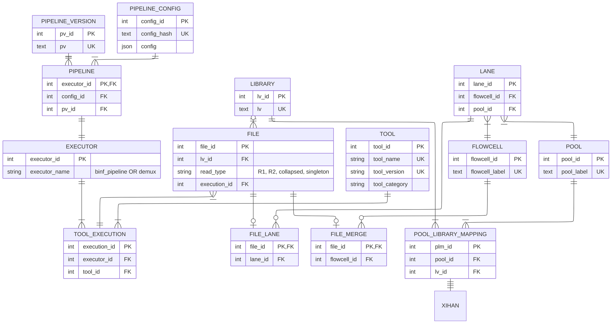

NOTE:
 1. An executor of a tool can either be a binf pipeline or sequencing pipeline. Binf pipeline has its own table because it has specific fields defining it. Seq pipeline does not as far as I am aware.
 2. A file can either be of merge or lane type. Each of these types are slightly different. A merge type references a FLOWCELL, because we only know that it came from multiple lanes of a FLOWCELL and a lane type references a lane because we know which lane it came from. We can figure out which lanes the merge type file is made from by using the POOL_LIBRARY_MAPPING, POOL and LANE tables, but its not that easy. A more natural way would be to make a lane group (see lane_group_v1.md).

