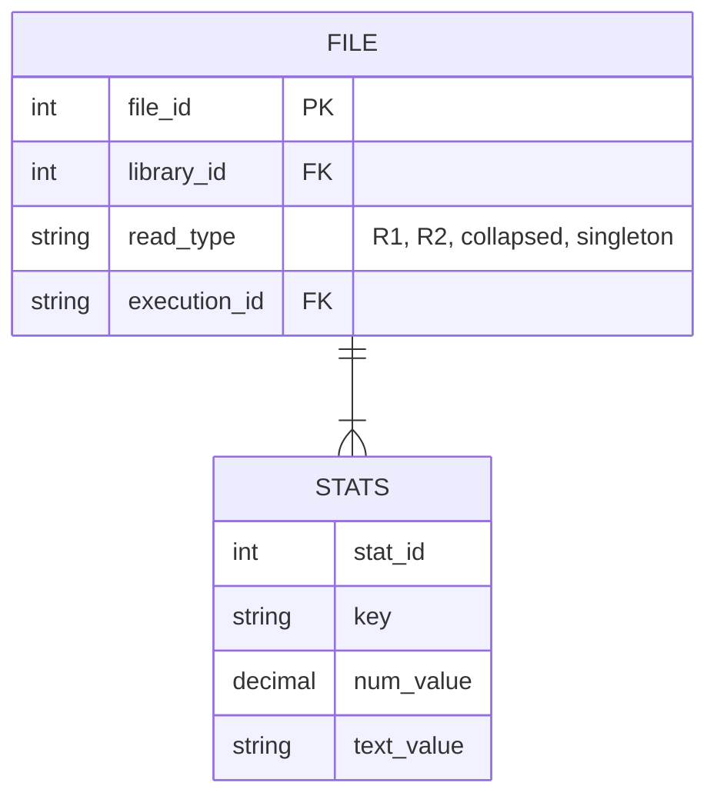

```mermaid
erDiagram
    FILE ||--|{ STATS : ""

    FILE {
        int file_id PK
        int library_id FK
        string read_type "R1, R2, collapsed, singleton"  
        string execution_id FK 
    }

    STATS {
        int stat_id
        string key
        decimal num_value
        string text_value
    }

```

