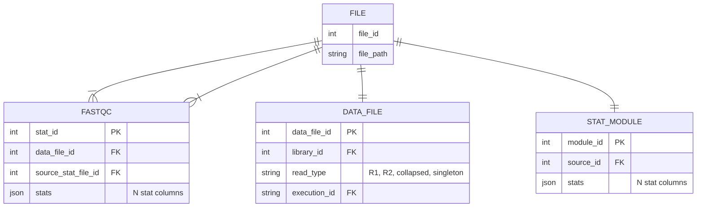

```mermaid
erDiagram
    FILE ||--|{ FASTQC : ""
    FILE ||--|{ FASTQC : ""
    FILE ||--|| DATA_FILE : ""
    FILE ||--|| STAT_MODULE : ""

    DATA_FILE {
        int data_file_id PK
        int library_id FK
        string read_type "R1, R2, collapsed, singleton"  
        string execution_id FK 
    }

    FILE {
        int file_id
        string file_path  
    }

    FASTQC {
        int stat_id PK
        int data_file_id FK
        int source_stat_file_id FK
        json stats "N stat columns"
    }

    STAT_MODULE {
        int module_id PK
        int source_id FK
        json stats "N stat columns"
    }

```

