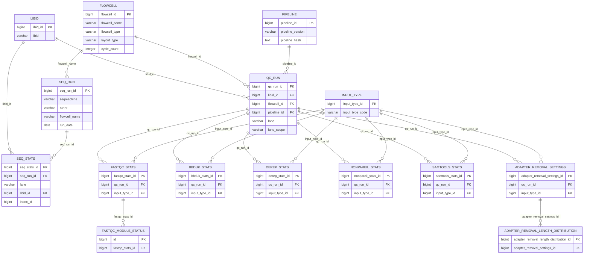
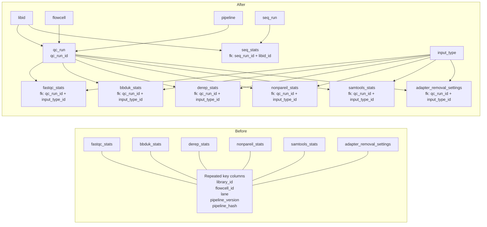
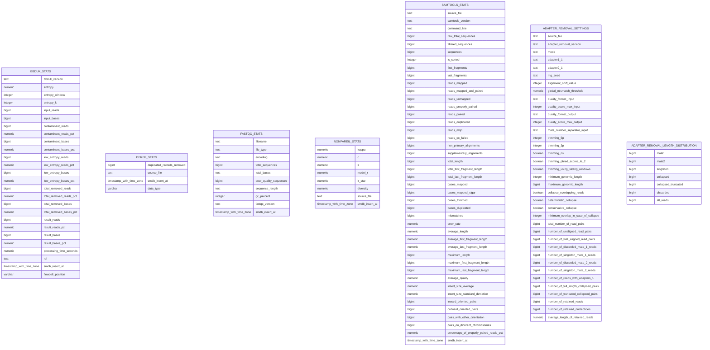

# Normalized `qc` model proposal

This proposal starts from the repeated identifying columns found across the
current schema:

- `library_id`
- `flowcell_id`
- `lane`
- `pipeline_version`
- `pipeline_hash`

The core normalization idea is to lift those columns into one shared parent
entity and let downstream QC result tables reference that parent by a single
surrogate key.

## 1. New shared key

Create one parent table that represents the exact processing context for a QC
result row.

### `qc_run`

```text
qc_run_id          bigint PK
library_id         varchar not null
flowcell_id        varchar not null
lane               varchar not null
pipeline_version   varchar not null
pipeline_hash      text    not null

UNIQUE (library_id, flowcell_id, lane, pipeline_version, pipeline_hash)
```

This gives us one stable key:

```text
qc_run_id
```

instead of repeating the five-column natural key in many child tables.

## 2. Recommended parent hierarchy

The repeated columns actually mix two different concepts:

1. the library/run identity
2. the pipeline execution identity

So the cleanest normalized design is a small hierarchy instead of only one
table.

### `libid`

```text
libid_id           bigint PK
libid              varchar not null unique
```

This table is intentionally minimal: one surrogate key and one business key.

### `flowcell`

```text
flowcell_id        bigint PK
flowcell_name      varchar not null unique
flowcell_type      varchar not null
layout_type        varchar not null
cycle_count        integer not null
```

Suggested meaning:

- `flowcell_name`: the actual flowcell identifier
- `flowcell_type`: for example `S1`, `S2`, `S4`
- `layout_type`: `PE` or `SE`
- `cycle_count`: total sequencing cycles

Suggested constraints:

```text
CHECK (layout_type IN ('PE', 'SE'))
CHECK (cycle_count > 0)
```

### `seq_run`

This table represents a sequencing instrument run.

```text
seq_run_id         bigint PK
seqmachine         varchar not null
runnr              varchar not null
flowcell_name      varchar not null FK -> flowcell.flowcell_name
run_date           date    not null
```

Suggested meaning:

- `seqmachine`: sequencing instrument identifier or name
- `runnr`: run number from the instrument
- `flowcell_name`: flowcell identifier recorded for the sequencing run
- `run_date`: date of the sequencing run

### `pipeline`

This should stay simple unless you later need richer release metadata.

```text
pipeline_id        bigint PK
pipeline_version   varchar not null
pipeline_hash      text    not null

UNIQUE (pipeline_version, pipeline_hash)
```

This means one row per distinct pipeline build, for example:

```text
pipeline_id = 7
pipeline_version = 1.4.2
pipeline_hash = a1b2c3d4
```

That is enough if you expect only a limited number of versions and hashes.

### `qc_run`

```text
qc_run_id          bigint PK
libid_id           bigint not null FK -> libid.libid_id
flowcell_id        bigint not null FK -> flowcell.flowcell_id
pipeline_id        bigint not null FK -> pipeline.pipeline_id
lane               varchar null
lane_scope         varchar not null

UNIQUE (libid_id, flowcell_id, pipeline_id, lane, lane_scope)
```

Suggested constraints:

```text
CHECK (lane_scope IN ('single_lane', 'all_lanes'))
CHECK (
    (lane_scope = 'single_lane' AND lane IS NOT NULL) OR
    (lane_scope = 'all_lanes' AND lane IS NULL)
)
```

This version is more normalized than a single wide parent because:

- libid information lives once
- flowcell metadata lives once
- pipeline information lives once
- the combination between sample context and pipeline is explicit
- the lane semantics are explicit without inventing fake lane values

If you want the smallest possible migration step, you can start with the
single-table `qc_run` design and split it later.

## 3. Where input distinctions belong

Input-specific distinctions should not be forced into `qc_run`.

Recommended rule:

- keep `lane` in `qc_run`, but make it nullable
- add `lane_scope` so we can distinguish single-lane from all-lanes rows
- use `input_type_id` in stats tables to describe whether a run was on
  `rawR1`, `trimPair`, `collapsed`, `bam`, and so on
- use explicit tool-specific stats tables as the target design

The important change from version 2 is this:

- `metrics_json` is no longer the intended end state
- it is only a transitional placeholder if migration has to happen in phases
- the real target is one explicit table per QC tool, with concrete metric
  columns

That keeps `qc_run` stable while still letting the tool-level tables capture
what they actually ran on.

## 4. Suggested normalized result tables

Below is the structural target model.

The main QC tool tables are keyed by `qc_run_id` and `input_type_id`, while
`seq_stats` is a separate parallel track keyed by `seq_run_id` together with
sample- and lane-specific context.

In all cases, the target is explicit metric columns rather than a generic JSON
field.

### `input_type`

```text
input_type_id      bigint PK
input_type_code    varchar not null unique
```

### `seq_stats`

```text
seq_stats_id                   bigint PK
seq_run_id                     bigint not null FK -> seq_run.seq_run_id
lane                           varchar not null
libid_id                       bigint not null FK -> libid.libid_id
index_id                       bigint null
read_count                     bigint null
perfect_index_read_count       bigint null
one_mismatch_index_read_count  bigint null
two_mismatch_index_read_count  bigint null
read_pct                       numeric null
perfect_index_read_pct         numeric null
one_mismatch_index_read_pct    numeric null
two_mismatch_index_read_pct    numeric null
```

Notes:

- `sample_project` is intentionally omitted
- `index_id` is expected to refer to the Xihan index definition, but that
  table is not modeled in this document yet
- `lane` is kept directly in `seq_stats` because the row is lane-specific
- `libid_id` is the normalized replacement for `SampleID`

### `bbduk_stats`

```text
bbduk_stats_id     bigint PK
qc_run_id          bigint not null FK -> qc_run.qc_run_id
input_type_id      bigint not null FK -> input_type.input_type_id

UNIQUE (qc_run_id, input_type_id)
```

Concrete metric columns should live in `bbduk_stats` itself.

### `derep_stats`

```text
derep_stats_id     bigint PK
qc_run_id          bigint not null FK -> qc_run.qc_run_id
input_type_id      bigint not null FK -> input_type.input_type_id

UNIQUE (qc_run_id, input_type_id)
```

Concrete metric columns should live in `derep_stats` itself.

### `nonpareil_stats`

```text
nonpareil_stats_id bigint PK
qc_run_id          bigint not null FK -> qc_run.qc_run_id
input_type_id      bigint not null FK -> input_type.input_type_id

UNIQUE (qc_run_id, input_type_id)
```

Concrete metric columns should live in `nonpareil_stats` itself.

### `samtools_stats`

```text
samtools_stats_id  bigint PK
qc_run_id          bigint not null FK -> qc_run.qc_run_id
input_type_id      bigint not null FK -> input_type.input_type_id

UNIQUE (qc_run_id, input_type_id)
```

Concrete metric columns should live in `samtools_stats` itself.

### `fastqc_stats`

```text
fastqc_stats_id    bigint PK
qc_run_id          bigint not null FK -> qc_run.qc_run_id
input_type_id      bigint not null FK -> input_type.input_type_id

UNIQUE (qc_run_id, input_type_id)
```

The FastQC detail tables stay structurally the same, but continue to reference
only `fastqc_stats_id`.

### `adapter_removal_settings`

```text
adapter_removal_settings_id bigint PK
qc_run_id                   bigint not null FK -> qc_run.qc_run_id
input_type_id               bigint not null FK -> input_type.input_type_id

UNIQUE (qc_run_id, input_type_id)
```

### `adapter_removal_length_distribution`

```text
adapter_removal_length_distribution_id bigint PK
adapter_removal_settings_id            bigint not null
                                       FK -> adapter_removal_settings.adapter_removal_settings_id
length                                 integer not null

UNIQUE (adapter_removal_settings_id, length)
```

## 5. Mermaid sketch



## 5b. Change overview

This diagram focuses specifically on the structural change:

- before: many QC tables repeat the same identifying columns
- after: those columns move into shared parent tables, while QC tool tables
  point to `qc_run_id` and sequencing-run statistics live in the separate
  `seq_stats` track



## 6. Tool-specific stats tables

This section is intentionally not a relationship diagram.

The tables below are shown as standalone boxes with no keys and no lines.
They are included as the concrete metric targets that should replace
`metrics_json` in the final model.



## 7. FastQC detail tables

These remain separate child tables under `fastqc_stats`, but they are shown
here without keys and without relationship lines because the purpose of this
section is only to expose the concrete metric columns.

```mermaid
erDiagram
    FASTQC_ADAPTER_CONTENT {
        numeric illumina_universal
        numeric illumina_small_rna_3
        numeric illumina_small_rna_5
        numeric nextera_transposase
        numeric poly_a
        numeric poly_g
        timestamp_with_time_zone smdb_insert_at
    }

    FASTQC_KMER_CONTENT {
        bigint count
        numeric obs_exp_max
        text obs_exp_max_at
        timestamp_with_time_zone smdb_insert_at
    }

    FASTQC_MODULE_STATUS {
        text status
        timestamp_with_time_zone smdb_insert_at
    }

    FASTQC_OVERREPRESENTED_SEQUENCES {
        bigint count
        numeric percentage
        text source
        timestamp_with_time_zone smdb_insert_at
    }

    FASTQC_PER_BASE_N_CONTENT {
        numeric n_count
        timestamp_with_time_zone smdb_insert_at
    }

    FASTQC_PER_BASE_QUALITY {
        numeric mean
        numeric median
        numeric lower_quartile
        numeric upper_quartile
        numeric percentile_10
        numeric percentile_90
        timestamp_with_time_zone smdb_insert_at
    }

    FASTQC_PER_BASE_SEQUENCE_CONTENT {
        numeric g
        numeric a
        numeric t
        numeric c
        timestamp_with_time_zone smdb_insert_at
    }

    FASTQC_PER_SEQUENCE_GC_CONTENT {
        numeric count
        timestamp_with_time_zone smdb_insert_at
    }

    FASTQC_PER_SEQUENCE_QUALITY {
        numeric count
        timestamp_with_time_zone smdb_insert_at
    }

    FASTQC_PER_TILE_QUALITY {
        numeric mean
        timestamp_with_time_zone smdb_insert_at
    }

    FASTQC_SEQUENCE_DUPLICATION_LEVELS {
        numeric total_deduplicated_pct
        numeric percentage_of_total
        timestamp_with_time_zone smdb_insert_at
    }

    FASTQC_SEQUENCE_LENGTH_DISTRIBUTION {
        numeric count
        timestamp_with_time_zone smdb_insert_at
        double_precision length_midpoint
    }
```


