# Current `qc` schema — key-column ERD

This diagram reflects the live `smdb.qc` schema on 2026-07-23.

Only structural key columns are shown:

- primary-key columns (`PK`);
- foreign-key columns (`FK`);
- columns participating in important unique business keys (`UK`).

The reporting view `end_user_available_stats` and materialized view
`end_user_available_stats_wide` are omitted because they do not own relational
constraints. Non-key measurement and audit metadata columns are also omitted.

```mermaid
erDiagram
    QC_RUN {
        varchar flowcell_id PK
        varchar pipeline_version PK
        text pipeline_hash PK
        varchar library_id PK
        integer id UK
        varchar source_path UK
        uuid smdb_upload_uuid UK
    }

    ADAPTER_REMOVAL_SETTINGS {
        bigint settings_id PK
        text flowcell_id FK
        text pipeline_version FK
        text pipeline_hash FK
        text library_id FK
        text data_type UK
        text lane UK
        text sequencing_method UK
    }

    ADAPTER_REMOVAL_LENGTH_DISTRIBUTION {
        bigint id PK
        bigint settings_id FK
        integer length UK
    }

    BBDUK_STATS {
        text flowcell_id PK,FK
        text pipeline_version PK,FK
        text pipeline_hash PK,FK
        text library_id PK,FK
        text read_type PK
        varchar data_type PK
        varchar lane PK
        integer id UK
        text source_file UK
    }

    DEREP_STATS {
        bigint id PK
        varchar flowcell_id FK
        varchar pipeline_version FK
        varchar pipeline_hash FK
        varchar library_id FK
        varchar read_type UK
        varchar lane UK
    }

    FASTQC_STATS {
        bigint fastqc_stats_id PK
        text flowcell_id FK
        text pipeline_version FK
        text pipeline_hash FK
        text library_id FK
        text data_type UK
        text lane UK
        text read_type UK
        text source_file UK
    }

    FASTQC_ADAPTER_CONTENT {
        bigint id PK
        bigint fastqc_stats_id FK
        text position UK
    }

    FASTQC_KMER_CONTENT {
        bigint id PK
        bigint fastqc_stats_id FK
        text sequence UK
    }

    FASTQC_MODULE_STATUS {
        bigint id PK
        bigint fastqc_stats_id FK
        text module_name UK
    }

    FASTQC_OVERREPRESENTED_SEQUENCES {
        bigint id PK
        bigint fastqc_stats_id FK
        text sequence UK
    }

    FASTQC_PER_BASE_N_CONTENT {
        bigint id PK
        bigint fastqc_stats_id FK
        text base UK
    }

    FASTQC_PER_BASE_QUALITY {
        bigint id PK
        bigint fastqc_stats_id FK
        text base UK
    }

    FASTQC_PER_BASE_SEQUENCE_CONTENT {
        bigint id PK
        bigint fastqc_stats_id FK
        text base UK
    }

    FASTQC_PER_SEQUENCE_GC_CONTENT {
        bigint id PK
        bigint fastqc_stats_id FK
        integer gc_content UK
    }

    FASTQC_PER_SEQUENCE_QUALITY {
        bigint id PK
        bigint fastqc_stats_id FK
        integer quality UK
    }

    FASTQC_PER_TILE_QUALITY {
        bigint id PK
        bigint fastqc_stats_id FK
        integer tile UK
        text base UK
    }

    FASTQC_SEQUENCE_DUPLICATION_LEVELS {
        bigint id PK
        bigint fastqc_stats_id FK
        text duplication_level UK
    }

    FASTQC_SEQUENCE_LENGTH_DISTRIBUTION {
        bigint id PK
        bigint fastqc_stats_id FK
        text length UK
    }

    NONPAREIL_STATS {
        bigint id PK
        varchar flowcell_id FK
        varchar pipeline_version FK
        varchar pipeline_hash FK
        varchar library_id FK
        varchar data_type UK
        varchar read_type UK
        varchar lane UK
    }

    SAMTOOLS_STATS {
        bigint id PK
        text flowcell_id FK
        text pipeline_version FK
        text pipeline_hash FK
        text library_id FK
        text data_type UK
        text lane UK
        text read_type UK
    }

    AUDIT_LOG {
        bigint id PK
    }

    QC_RUN ||--o{ ADAPTER_REMOVAL_SETTINGS : "identifies"
    ADAPTER_REMOVAL_SETTINGS ||--o{ ADAPTER_REMOVAL_LENGTH_DISTRIBUTION : "has"

    QC_RUN ||--o{ BBDUK_STATS : "identifies"
    QC_RUN ||--o{ DEREP_STATS : "identifies"
    QC_RUN ||--o{ FASTQC_STATS : "identifies"
    QC_RUN ||--o{ NONPAREIL_STATS : "identifies"
    QC_RUN ||--o{ SAMTOOLS_STATS : "identifies"

    FASTQC_STATS ||--o{ FASTQC_ADAPTER_CONTENT : "has"
    FASTQC_STATS ||--o{ FASTQC_KMER_CONTENT : "has"
    FASTQC_STATS ||--o{ FASTQC_MODULE_STATUS : "has"
    FASTQC_STATS ||--o{ FASTQC_OVERREPRESENTED_SEQUENCES : "has"
    FASTQC_STATS ||--o{ FASTQC_PER_BASE_N_CONTENT : "has"
    FASTQC_STATS ||--o{ FASTQC_PER_BASE_QUALITY : "has"
    FASTQC_STATS ||--o{ FASTQC_PER_BASE_SEQUENCE_CONTENT : "has"
    FASTQC_STATS ||--o{ FASTQC_PER_SEQUENCE_GC_CONTENT : "has"
    FASTQC_STATS ||--o{ FASTQC_PER_SEQUENCE_QUALITY : "has"
    FASTQC_STATS ||--o{ FASTQC_PER_TILE_QUALITY : "has"
    FASTQC_STATS ||--o{ FASTQC_SEQUENCE_DUPLICATION_LEVELS : "has"
    FASTQC_STATS ||--o{ FASTQC_SEQUENCE_LENGTH_DISTRIBUTION : "has"
```



## Structural summary

`qc_run` is the schema's hub. Its enforced primary key is the composite:

```text
(flowcell_id, pipeline_version, pipeline_hash, library_id)
```

The six tool-level tables reference that composite key. FastQC then has a
second level of one-to-many tables keyed through `fastqc_stats_id`.
`adapter_removal_length_distribution` similarly belongs to
`adapter_removal_settings` through `settings_id`.

`audit_log` is intentionally isolated in the ERD: audit triggers write to it,
but it has no declarative foreign key to the audited tables.
