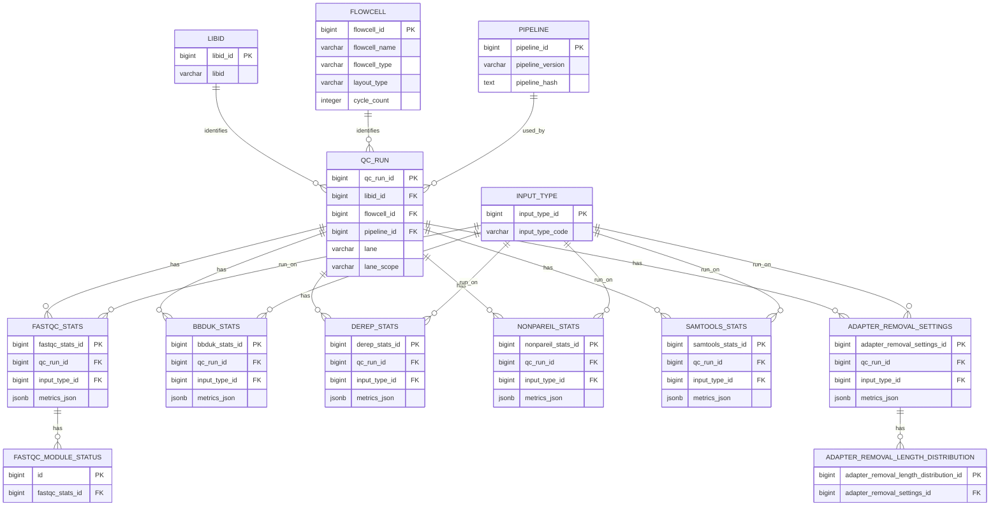
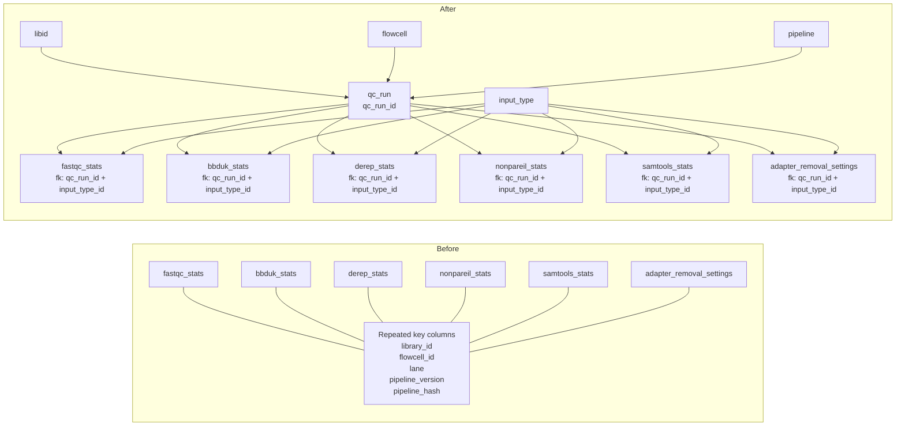

# Normalized `qc` model proposal

This proposal starts from the repeated identifying columns found across the
current schema:

- `library_id`
- `flowcell_id`
- `lane`
- `pipeline_version`
- `pipeline_hash`

The core normalization idea is to lift those columns into one shared parent
entity and let downstream QC result tables reference that parent by a single
surrogate key.

## 1. New shared key

Create one parent table that represents the exact processing context for a QC
result row.

### `qc_run`

```text
qc_run_id          bigint PK
library_id         varchar not null
flowcell_id        varchar not null
lane               varchar not null
pipeline_version   varchar not null
pipeline_hash      text    not null

UNIQUE (library_id, flowcell_id, lane, pipeline_version, pipeline_hash)
```

This gives us one stable key:

```text
qc_run_id
```

instead of repeating the five-column natural key in many child tables.

## 2. Recommended parent hierarchy

The repeated columns actually mix two different concepts:

1. the library/run identity
2. the pipeline execution identity

So the cleanest normalized design is a small hierarchy instead of only one
table.

### `libid`

```text
libid_id           bigint PK
libid              varchar not null unique
```

This table is intentionally minimal: one surrogate key and one business key.

### `flowcell`

```text
flowcell_id        bigint PK
flowcell_name      varchar not null unique
flowcell_type      varchar not null
layout_type        varchar not null
cycle_count        integer not null
```

Suggested meaning:

- `flowcell_name`: the actual flowcell identifier
- `flowcell_type`: for example `S1`, `S2`, `S4`
- `layout_type`: `PE` or `SE`
- `cycle_count`: total sequencing cycles

Suggested constraints:

```text
CHECK (layout_type IN ('PE', 'SE'))
CHECK (cycle_count > 0)
```

### `pipeline`

This should stay simple unless you later need richer release metadata.

```text
pipeline_id        bigint PK
pipeline_version   varchar not null
pipeline_hash      text    not null

UNIQUE (pipeline_version, pipeline_hash)
```

This means one row per distinct pipeline build, for example:

```text
pipeline_id = 7
pipeline_version = 1.4.2
pipeline_hash = a1b2c3d4
```

That is enough if you expect only a limited number of versions and hashes.

### `qc_run`

```text
qc_run_id          bigint PK
libid_id           bigint not null FK -> libid.libid_id
flowcell_id        bigint not null FK -> flowcell.flowcell_id
pipeline_id        bigint not null FK -> pipeline.pipeline_id
lane               varchar null
lane_scope         varchar not null

UNIQUE (libid_id, flowcell_id, pipeline_id, lane, lane_scope)
```

Suggested constraints:

```text
CHECK (lane_scope IN ('single_lane', 'all_lanes'))
CHECK (
    (lane_scope = 'single_lane' AND lane IS NOT NULL) OR
    (lane_scope = 'all_lanes' AND lane IS NULL)
)
```

This version is more normalized than a single wide parent because:

- libid information lives once
- flowcell metadata lives once
- pipeline information lives once
- the combination between sample context and pipeline is explicit
- the lane semantics are explicit without inventing fake lane values

If you want the smallest possible migration step, you can start with the
single-table `qc_run` design and split it later.

## 3. Where input distinctions belong

Input-specific distinctions should not be forced into `qc_run`.

Recommended rule:

- keep `lane` in `qc_run`, but make it nullable
- add `lane_scope` so we can distinguish single-lane from all-lanes rows
- use `input_type_id` in stats tables to describe whether a run was on
  `rawR1`, `trimPair`, `collapsed`, `bam`, and so on
- use `metrics_json` as a temporary holder for the concrete measurement columns
  until each tool's final metric set is known

That keeps `qc_run` stable while still letting the tool-level tables capture
what they actually ran on.

## 4. Suggested normalized result tables

Below is a practical target model based on the current schema.

Important note on `metrics_json`:

- `metrics_json` is only a temporary placeholder
- the intention is that each tool table will later get its own explicit metric
  columns
- `metrics_json` exists so the structural model can be agreed before every
  final metric set is known

### `bbduk_stats`

```text
bbduk_stats_id     bigint PK
qc_run_id          bigint not null FK -> qc_run.qc_run_id
input_type_id      bigint not null FK -> input_type.input_type_id
metrics_json       jsonb not null

UNIQUE (qc_run_id, input_type_id)
```

### `derep_stats`

```text
derep_stats_id     bigint PK
qc_run_id          bigint not null FK -> qc_run.qc_run_id
input_type_id      bigint not null FK -> input_type.input_type_id
metrics_json       jsonb not null

UNIQUE (qc_run_id, input_type_id)
```

This is intentionally generic for now:

- one `derep_stats` row per `qc_run` and `input_type`
- all measurement columns are stored in `metrics_json` until the final metric
  set is known
- later, those derep-specific measurements should be unfolded into explicit
  columns in `derep_stats`

### `nonpareil_stats`

```text
nonpareil_stats_id bigint PK
qc_run_id          bigint not null FK -> qc_run.qc_run_id
input_type_id      bigint not null FK -> input_type.input_type_id
metrics_json       jsonb not null

UNIQUE (qc_run_id, input_type_id)
```

### `samtools_stats`

```text
samtools_stats_id  bigint PK
qc_run_id          bigint not null FK -> qc_run.qc_run_id
input_type_id      bigint not null FK -> input_type.input_type_id
metrics_json       jsonb not null

UNIQUE (qc_run_id, input_type_id)
```

### `fastqc_stats`

```text
fastqc_stats_id    bigint PK
qc_run_id          bigint not null FK -> qc_run.qc_run_id
input_type_id      bigint not null FK -> input_type.input_type_id
metrics_json       jsonb not null

UNIQUE (qc_run_id, input_type_id)
```

The FastQC detail tables stay structurally the same, but continue to reference
only `fastqc_stats_id`.

### `adapter_removal_settings`

```text
adapter_removal_settings_id bigint PK
qc_run_id                   bigint not null FK -> qc_run.qc_run_id
input_type_id               bigint not null FK -> input_type.input_type_id
metrics_json                jsonb not null

UNIQUE (qc_run_id, input_type_id)
```

### `adapter_removal_length_distribution`

```text
adapter_removal_length_distribution_id bigint PK
adapter_removal_settings_id            bigint not null
                                       FK -> adapter_removal_settings.adapter_removal_settings_id
length                                 integer not null

UNIQUE (adapter_removal_settings_id, length)
```

## 5. Mermaid sketch



## 5b. Change overview

This diagram focuses specifically on the structural change:

- before: many QC tables repeat the same identifying columns
- after: those columns move into shared parent tables and child tables point to
  `qc_run_id`



## 6. Why this is better

- The five repeated identity columns move to one place.
- Child tables get short foreign keys and simpler joins.
- Pipeline version/hash are modeled once and can be reused across many rows.
- Constraints become easier to reason about and maintain.
- Future QC tools can plug into the same `qc_run` parent.

## 7. Important design choice

There is one thing we should decide before implementing:

Should `lane` really be part of the parent context key for all QC tools?

That is probably right given the current schema, but if some tools are actually
reported per library or per flowcell rather than per lane, then `lane` should
move down into only those specific child tables.

## 8. Recommendation

My recommendation is:

1. introduce `libid`
2. introduce `flowcell`
3. introduce `pipeline`
4. introduce `qc_run`
5. use `input_type` as the shared way to describe what a tool was run on
6. migrate tool-level tables to reference `qc_run_id`
7. add input references where you need to know exactly what a tool ran on
8. keep input-specific details out of the parent key unless you later prove
   they are universally part of the same grain

That gives you a normalized model without overfitting the shared parent key.

## 9. Current preferred base tables

Based on the latest direction, the current preferred base tables under
`qc_run` are these:

### `libid`

```text
libid_id           bigint PK
libid              varchar not null unique
```

### `flowcell`

```text
flowcell_id        bigint PK
flowcell_name      varchar not null unique
flowcell_type      varchar not null
layout_type        varchar not null
cycle_count        integer not null
```

### `pipeline`

```text
pipeline_id        bigint PK
pipeline_version   varchar not null
pipeline_hash      text not null

UNIQUE (pipeline_version, pipeline_hash)
```

### `qc_run`

```text
qc_run_id              bigint PK
libid_id               bigint not null FK
flowcell_id            bigint not null FK
pipeline_id            bigint not null FK
lane                   varchar null
lane_scope             varchar not null

UNIQUE (libid_id, flowcell_id, pipeline_id, lane, lane_scope)
```

Suggested constraints:

```text
CHECK (lane_scope IN ('single_lane', 'all_lanes'))
CHECK (
    (lane_scope = 'single_lane' AND lane IS NOT NULL) OR
    (lane_scope = 'all_lanes' AND lane IS NULL)
)
```

So `qc_run` is kept fixed as the shared library-centered context and does
not need to absorb file-level input details.

For the pipeline part specifically, the intended design is deliberately small:

- one surrogate key
- one pipeline version
- one pipeline hash
- one uniqueness rule on `(pipeline_version, pipeline_hash)`

## 10. Input types

### `input_type`

```text
input_type_id      bigint PK
input_type_code    varchar not null unique
description        text null
```

Suggested starting values:

```text
rawR1
rawR2
rawPair
trimR1
trimR2
trimPair
collapsed
bam
```

Recommended rule:

- treat `input_type_code` as a controlled vocabulary
- do not introduce ad hoc spellings such as `trim_r1`, `trimmedR1`, or
  `raw-r1`
- add new values only when they represent a genuinely new logical analysis
  input

Recommended fixed values for the first version:

| `input_type_code` | Meaning |
| --- | --- |
| `rawR1` | Raw read 1 |
| `rawR2` | Raw read 2 |
| `rawPair` | Raw paired reads treated as one logical input |
| `trimR1` | Trimmed read 1 |
| `trimR2` | Trimmed read 2 |
| `trimPair` | Trimmed paired reads treated as one logical input |
| `collapsed` | Collapsed reads |
| `bam` | Alignment BAM input |

Recommended constraints:

- `UNIQUE (input_type_code)`
- `CHECK (input_type_code <> '')`

### How stats tables would use this

Where needed, a tool-level stats table can reference `input_type_id` directly
alongside `qc_run_id`.

For example:

```text
derep_stats_id     bigint PK
qc_run_id          bigint not null FK -> qc_run.qc_run_id
input_type_id      bigint not null FK -> input_type.input_type_id
metrics_json       jsonb not null
```

That way:

- `qc_run_id` says which library-centered context the result belongs to
- `input_type_id` says whether the run was on `rawR1`, `rawR2`, `trimPair`,
  `collapsed`, `bam`, or another defined input

For `derep_stats`, the current plan is to use `metrics_json` as a temporary
generic holder for the actual measurement values until the final set of derep
metrics is known. It should be treated as a placeholder rather than the final
long-term design for statistics storage.

## 11. Recommended constraints and indexes

These are the practical database rules I would recommend for the first working
version.

### Constraints

#### `libid`

```text
PRIMARY KEY (libid_id)
UNIQUE (libid)
CHECK (libid <> '')
```

#### `flowcell`

```text
PRIMARY KEY (flowcell_id)
UNIQUE (flowcell_name)
CHECK (flowcell_name <> '')
CHECK (flowcell_type <> '')
CHECK (layout_type IN ('PE', 'SE'))
CHECK (cycle_count > 0)
```

If you add `lane_count`, also add:

```text
CHECK (lane_count > 0)
```

#### `pipeline`

```text
PRIMARY KEY (pipeline_id)
UNIQUE (pipeline_version, pipeline_hash)
CHECK (pipeline_version <> '')
CHECK (pipeline_hash <> '')
```

#### `qc_run`

```text
PRIMARY KEY (qc_run_id)
UNIQUE (libid_id, flowcell_id, pipeline_id, lane, lane_scope)
CHECK (lane_scope IN ('single_lane', 'all_lanes'))
CHECK (
    (lane_scope = 'single_lane' AND lane IS NOT NULL) OR
    (lane_scope = 'all_lanes' AND lane IS NULL)
)
```

#### `input_type`

```text
PRIMARY KEY (input_type_id)
UNIQUE (input_type_code)
CHECK (input_type_code <> '')
```

#### Stats tables

Use the same pattern for:

- `bbduk_stats`
- `derep_stats`
- `fastqc_stats`
- `nonpareil_stats`
- `samtools_stats`
- `adapter_removal_settings`

```text
PRIMARY KEY (<table>_id)
FOREIGN KEY (qc_run_id) REFERENCES qc_run(qc_run_id)
FOREIGN KEY (input_type_id) REFERENCES input_type(input_type_id)
UNIQUE (qc_run_id, input_type_id)
```

#### Child tables under parent stats

```text
PRIMARY KEY (<child_table>_id)
FOREIGN KEY (...) REFERENCES parent_table(...)
UNIQUE (parent_id, logical_subkey)
```

Example:

```text
UNIQUE (adapter_removal_settings_id, length)
```

### Indexes

Recommended indexes for common lookup patterns:

#### `qc_run`

```text
INDEX ON qc_run (libid_id)
INDEX ON qc_run (flowcell_id)
INDEX ON qc_run (pipeline_id)
INDEX ON qc_run (lane_scope)
```

#### Stats tables

```text
INDEX ON bbduk_stats (qc_run_id)
INDEX ON derep_stats (qc_run_id)
INDEX ON fastqc_stats (qc_run_id)
INDEX ON nonpareil_stats (qc_run_id)
INDEX ON samtools_stats (qc_run_id)
INDEX ON adapter_removal_settings (qc_run_id)
```

If you expect frequent filtering by input type within one tool table, also add:

```text
INDEX ON <stats_table> (input_type_id)
```

#### Parent-child detail tables

```text
INDEX ON adapter_removal_length_distribution (adapter_removal_settings_id)
INDEX ON fastqc_module_status (fastqc_stats_id)
```

### Optional reporting helper

If reporting users often need library-centered extracts, consider a flattened
view later that joins:

- `qc_run`
- `libid`
- `flowcell`
- `pipeline`

That can make downstream querying simpler without changing the normalized
storage model.
