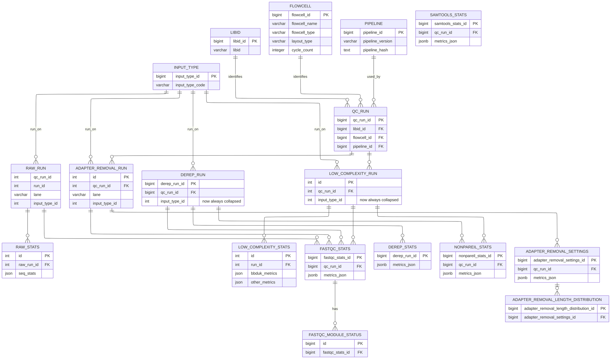

```mermaid
---
config:
  layout: elk
  er:
    layoutDirection: LR
    nodeSpacing: 190
    rankSpacing: 130
    entityPadding: 9
    minEntityWidth: 80
    minEntityHeight: 50
    fontSize: 11
    diagramPadding: 20
    useMaxWidth: false
---
erDiagram
    LIBID {
        bigint libid_id PK
        varchar libid
    }

    FLOWCELL {
        bigint flowcell_id PK
        varchar flowcell_name
        varchar flowcell_type
        varchar layout_type
        integer cycle_count
    }

    PIPELINE {
        bigint pipeline_id PK
        varchar pipeline_version
        text pipeline_hash
    }

    INPUT_TYPE {
        bigint input_type_id PK
        varchar input_type_code
    }

    QC_RUN {
        bigint qc_run_id PK
        bigint libid_id FK
        bigint flowcell_id FK
        bigint pipeline_id FK
    }

    RAW_RUN {
        int qc_run_id
        int run_id
        varchar lane
        int input_type_id
    }

    RAW_STATS {
        int id PK
        int raw_run_id FK
        json seq_stats
    }

    ADAPTER_REMOVAL_RUN {
        int id PK
        int qc_run_id FK
        varchar lane
        int input_type_id
    }

    DEREP_RUN {
        bigint derep_run_id PK
        bigint qc_run_id FK
        int input_type_id "now always collapsed"
    }

    LOW_COMPLEXITY_RUN {
        int id PK
        int qc_run_id FK
        int input_type_id "now always collapsed"
    }

    LOW_COMPLEXITY_STATS {
        int id PK 
        int run_id FK
        json bbduk_metrics
        json other_metrics
    }

    FASTQC_STATS {
        bigint fastqc_stats_id PK
        bigint qc_run_id FK
        jsonb metrics_json
    }

    DEREP_STATS {
        bigint derep_run_id PK
        jsonb metrics_json
    }

    NONPAREIL_STATS {
        bigint nonpareil_stats_id PK
        bigint qc_run_id FK
        jsonb metrics_json
    }

    SAMTOOLS_STATS {
        bigint samtools_stats_id PK
        bigint qc_run_id FK
        jsonb metrics_json
    }

    ADAPTER_REMOVAL_SETTINGS {
        bigint adapter_removal_settings_id PK
        bigint qc_run_id FK
        jsonb metrics_json
    }

    ADAPTER_REMOVAL_LENGTH_DISTRIBUTION {
        bigint adapter_removal_length_distribution_id PK
        bigint adapter_removal_settings_id FK
    }

    FASTQC_MODULE_STATUS {
        bigint id PK
        bigint fastqc_stats_id FK
    }

    LIBID ||--o{ QC_RUN : identifies
    FLOWCELL ||--o{ QC_RUN : identifies
    PIPELINE ||--o{ QC_RUN : used_by

    QC_RUN ||--o{ ADAPTER_REMOVAL_RUN : ""
    QC_RUN ||--o{ LOW_COMPLEXITY_RUN : ""

    ADAPTER_REMOVAL_RUN ||--o{ ADAPTER_REMOVAL_SETTINGS : ""
    ADAPTER_REMOVAL_SETTINGS ||--o{ ADAPTER_REMOVAL_LENGTH_DISTRIBUTION : ""
    ADAPTER_REMOVAL_RUN ||--o{ FASTQC_STATS : ""

    LOW_COMPLEXITY_RUN ||--o{ FASTQC_STATS : ""
    LOW_COMPLEXITY_RUN ||--o{ LOW_COMPLEXITY_STATS : ""
    LOW_COMPLEXITY_RUN ||--o{ NONPAREIL_STATS : ""

    RAW_RUN ||--o{ FASTQC_STATS : ""
    RAW_RUN ||--o{ RAW_STATS : ""

    DEREP_RUN ||--o{ FASTQC_STATS : ""
    DEREP_RUN ||--o{ DEREP_STATS : ""
    DEREP_RUN ||--o{ NONPAREIL_STATS : ""


    INPUT_TYPE ||--o{ ADAPTER_REMOVAL_RUN : run_on
    INPUT_TYPE ||--o{ RAW_RUN : run_on
    INPUT_TYPE ||--o{ LOW_COMPLEXITY_RUN : run_on
    INPUT_TYPE ||--o{ DEREP_RUN : run_on

    FASTQC_STATS ||--o{ FASTQC_MODULE_STATUS : has
```
