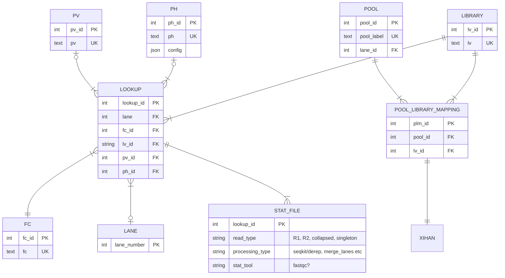

An idea to fix the lane merge issue. Notice that it is optional in the lookup table. Also the pv and ph are optional because stats from julie does not have any of those associated. A better fix to this would be to define pipeline and sequencing as processes. A process can then either be sequencing/demultiplexing or pipeline processing.

QUESTIONS: 
1. How to know which tool generated which stats?
2. How to do summary statistics of all stats that were generated with a specific tool? Or all stats associated with R1 data? Potential quick fix: make seperate tool and read type tables. 
3. What to do with lane collapsing? We could say lane = collapsed but what if a library is sequenced on lane 1, 2 on flowcell A and lane 3 and 4 on flowcell B, how do we know which exact sequencing results the lane-collapsed data references? In other words, how do we keep track of exactly which sequences were collapsed together? And what happens if we want to sum some stat for a specific library across all lanes. Do we want the merged stats included that sum? Or wouldnt that give us a sum that is doubled? Or just counting the lanes of  flowcell would give a wrong count. This issue happens if you mix differnent kinds of values in the same column (in this case "merged" is a processing result, and 1,2,3,4 are physical lanes). Filipe says that right now production only merges lanes on one flowcell at a time, but that in the future lanes across flowcells might be merged. But how many lanes within a flowcell that gets merged is not fixed, so we at least need a way to know what lane = merged means in terms of which lanes were merged together exactly. It could maybe be inferred by getting the distinct lanes for a specific library, because a library will alway be merged across all the lanes that it was sequenced on within a flowcell. But the count issue still applies no matter which work arounds we make.
4. Why does lane exist independently of flowcell? If we connect them we can validate that each flowcell has 4-8 lanes and that a lane is only associated with 1 flowcell. 
5. Where is read type specified (R1, R2, singleton, discarded, read_collapse)?
6. Do we need to distinguish 2 executions of the same pipeline version and configuration?
7. How to link to the rest of the SMDB and validate library-flowcell-lane combinations are correct? And how to link to julie data for example?
8. How to know which files were used to generate a stat? Or used to generate other files? In other words, how to track the provencance for files? Maybe its not important. Maybe it will be important in the future. For example if we need to model merging of X lanes, we need to know which lane files were merged into one file.
9. For merged data: How to know which lanes contributed to the merge?
10. how to validate that a flowcell has the correct number of lanes?

Conclusion:
It needs a way to identify which tool created which stat? derep/seqkit, merge_lanes, fastqc etc. 
It could work now but is not flexible and I expect that small changes in the system might result in a full redesign of the data model. One easy fix might be to just make the stats section more general. Also it relies on the system to be very standardized. Small edge cases might break it. For example: Lane 1 file is discarded or R1 is discarded and not used downstream.

In other words, it could work if we dont care about which exact file was produced from which exact files by which exact operation.

