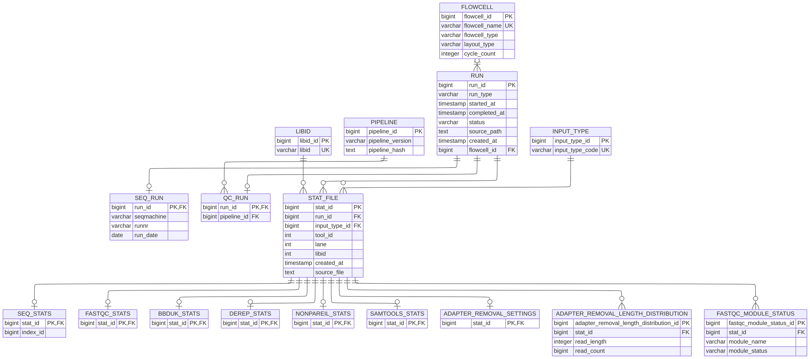

```mermaid
---
config:
  layout: elk
  er:
    entityPadding: 1
    diagramPadding: 7
    useMaxWidth: false
---
erDiagram
    LIBID {
        bigint libid_id PK
        varchar libid UK
    }

    FLOWCELL {
        bigint flowcell_id PK
        varchar flowcell_name UK
        varchar flowcell_type
        varchar layout_type
        integer cycle_count
    }

    PIPELINE {
        bigint pipeline_id PK
        varchar pipeline_version
        text pipeline_hash
    }

    RUN {
        bigint run_id PK
        varchar run_type
        timestamp started_at
        timestamp completed_at
        varchar status
        text source_path
        timestamp created_at
        bigint flowcell_id FK
    }

    SEQ_RUN {
        bigint run_id PK, FK
        varchar seqmachine
        varchar runnr
        date run_date
    }

    QC_RUN {
        bigint run_id PK, FK
        bigint pipeline_id FK
    }

    INPUT_TYPE {
        bigint input_type_id PK
        varchar input_type_code UK
    }


    STAT_FILE {
        bigint stat_id PK
        bigint run_id FK
        bigint input_type_id FK
        int tool_id 
        int lane
        int libid
        timestamp created_at
        text source_file
    }

    SEQ_STATS {
        bigint stat_id PK, FK
        bigint index_id
    }

    FASTQC_STATS {
        bigint stat_id PK, FK
    }

    BBDUK_STATS {
        bigint stat_id PK, FK
    }

    DEREP_STATS {
        bigint stat_id PK, FK
    }

    NONPAREIL_STATS {
        bigint stat_id PK, FK
    }

    SAMTOOLS_STATS {
        bigint stat_id PK, FK
    }

    ADAPTER_REMOVAL_SETTINGS {
        bigint stat_id PK, FK
    }

    ADAPTER_REMOVAL_LENGTH_DISTRIBUTION {
        bigint adapter_removal_length_distribution_id PK
        bigint stat_id FK
        integer read_length
        bigint read_count
    }

    FASTQC_MODULE_STATUS {
        bigint fastqc_module_status_id PK
        bigint stat_id FK
        varchar module_name
        varchar module_status
    }

    FLOWCELL ||--o{ RUN : ""
    LIBID ||--o{ STAT_FILE : ""

    RUN ||--o| SEQ_RUN : ""
    RUN ||--o| QC_RUN : ""

    PIPELINE ||--o{ QC_RUN : ""

    RUN ||--o{ STAT_FILE : ""
    INPUT_TYPE ||--o{ STAT_FILE : ""

    STAT_FILE ||--o| SEQ_STATS : ""
    STAT_FILE ||--o| FASTQC_STATS : ""
    STAT_FILE ||--o| BBDUK_STATS : ""
    STAT_FILE ||--o| DEREP_STATS : ""
    STAT_FILE ||--o| NONPAREIL_STATS : ""
    STAT_FILE ||--o| SAMTOOLS_STATS : ""
    STAT_FILE ||--o| ADAPTER_REMOVAL_SETTINGS : ""

    STAT_FILE ||--o{ ADAPTER_REMOVAL_LENGTH_DISTRIBUTION : ""
    STAT_FILE ||--o{ FASTQC_MODULE_STATUS : ""
```