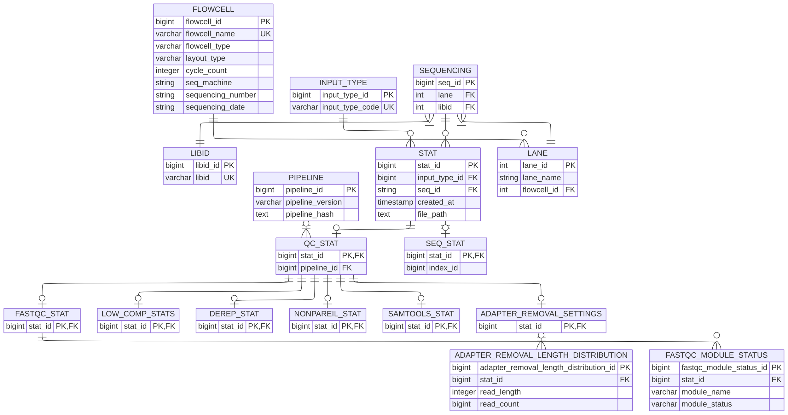

CHANGES: Lib and lane normalized out of stat.

```mermaid
---
config:
  layout: elk
  er:
    entityPadding: 1
    diagramPadding: 7
    useMaxWidth: false
---
erDiagram
    LIBID {
        bigint libid_id PK
        varchar libid UK
    }

    FLOWCELL {
        bigint flowcell_id PK
        varchar flowcell_name UK
        varchar flowcell_type
        varchar layout_type
        integer cycle_count
        string seq_machine
        string sequencing_number
        string sequencing_date
    }

    PIPELINE {
        bigint pipeline_id PK
        varchar pipeline_version
        text pipeline_hash
    }


    QC_STAT {
        bigint stat_id PK, FK
        bigint pipeline_id FK
    }

    INPUT_TYPE {
        bigint input_type_id PK
        varchar input_type_code UK
    }

    SEQUENCING {
        bigint seq_id PK
        int lane FK
        int libid FK
    }

    STAT {
        bigint stat_id PK
        bigint input_type_id FK
        string seq_id FK
        timestamp created_at
        text file_path
    }

    LANE {
        int lane_id PK
        string lane_name 
        int flowcell_id FK
    }

    SEQ_STAT {
        bigint stat_id PK, FK
        bigint index_id
    }

    FASTQC_STAT {
        bigint stat_id PK, FK
    }

    LOW_COMP_STATS {
        bigint stat_id PK, FK
    }

    DEREP_STAT {
        bigint stat_id PK, FK
    }

    NONPAREIL_STAT {
        bigint stat_id PK, FK
    }

    SAMTOOLS_STAT {
        bigint stat_id PK, FK
    }

    ADAPTER_REMOVAL_SETTINGS {
        bigint stat_id PK, FK
    }

    ADAPTER_REMOVAL_LENGTH_DISTRIBUTION {
        bigint adapter_removal_length_distribution_id PK
        bigint stat_id FK
        integer read_length
        bigint read_count
    }

    FASTQC_MODULE_STATUS {
        bigint fastqc_module_status_id PK
        bigint stat_id FK
        varchar module_name
        varchar module_status
    }

    FLOWCELL ||--o{ LANE : ""

    SEQUENCING }|--|| LIBID : ""
    SEQUENCING }|--|| LANE : ""

    SEQUENCING ||--o{ STAT : ""

    STAT ||--o| QC_STAT : ""

    PIPELINE ||--o{ QC_STAT : ""

    INPUT_TYPE ||--o{ STAT : ""
    

    STAT ||--o| SEQ_STAT : ""
    QC_STAT ||--o| FASTQC_STAT : ""
    QC_STAT ||--o| LOW_COMP_STATS : ""
    QC_STAT ||--o| DEREP_STAT : ""
    QC_STAT ||--o| NONPAREIL_STAT : ""
    QC_STAT ||--o| SAMTOOLS_STAT : ""
    QC_STAT ||--o| ADAPTER_REMOVAL_SETTINGS : ""

    ADAPTER_REMOVAL_SETTINGS ||--o{ ADAPTER_REMOVAL_LENGTH_DISTRIBUTION : ""
    FASTQC_STAT ||--o{ FASTQC_MODULE_STATUS : ""
```