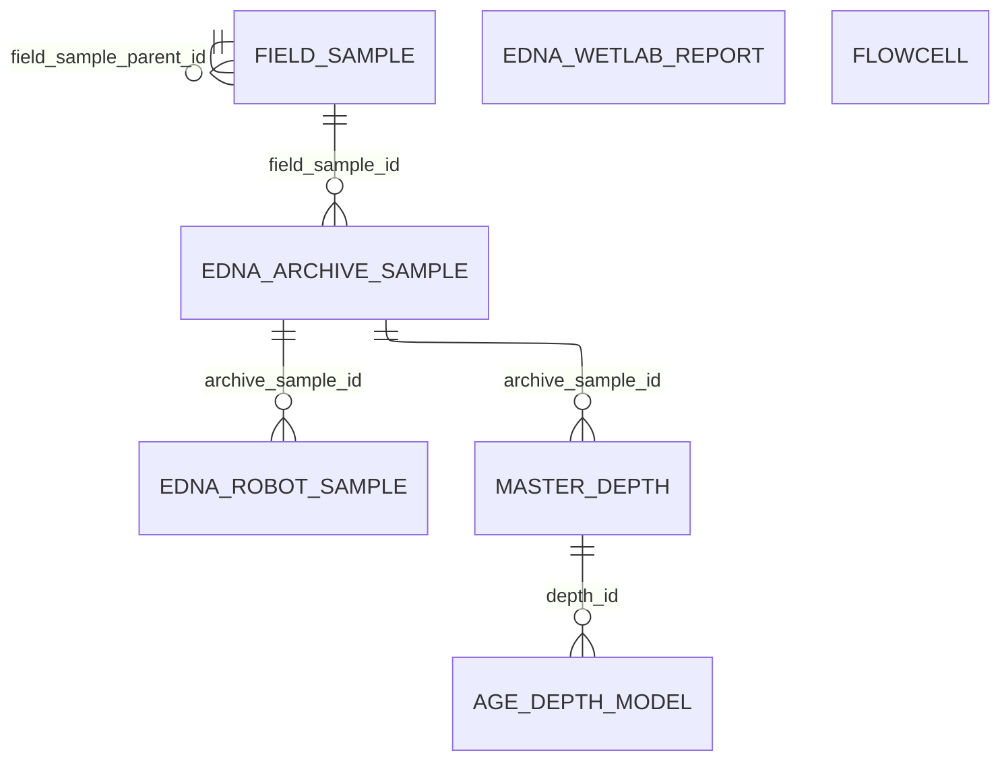

```mermaid
---
config:
  layout: elk
  er:
    layoutDirection: LR
    entityPadding: 8
    diagramPadding: 15
    useMaxWidth: false
---
erDiagram

    FIELD_SAMPLE {
    }

    EDNA_ARCHIVE_SAMPLE {
    }

    EDNA_ROBOT_SAMPLE {
    }

    MASTER_DEPTH {
    }

    AGE_DEPTH_MODEL {
    }

    EDNA_WETLAB_REPORT {
    }

    FLOWCELL {
    }

    FIELD_SAMPLE ||--o{ FIELD_SAMPLE : "field_sample_parent_id"
    FIELD_SAMPLE ||--o{ EDNA_ARCHIVE_SAMPLE : "field_sample_id"
    EDNA_ARCHIVE_SAMPLE ||--o{ EDNA_ROBOT_SAMPLE : "archive_sample_id"
    EDNA_ARCHIVE_SAMPLE ||--o{ MASTER_DEPTH : "archive_sample_id"
    MASTER_DEPTH ||--o{ AGE_DEPTH_MODEL : "depth_id"
```