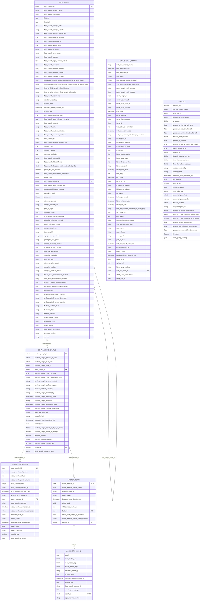

```mermaid
erDiagram
    FIELD_SAMPLE {
        citext field_sample_id UK
        citext field_sample_country_region
        string field_sample_site_name
        float latitude
        float longitude
        date field_sample_sample_date
        string field_sample_sample_provider
        string field_sample_running_project_title
        float field_sampling_depth_discrete
        float field_sampling_interval_to
        float field_sample_water_depth
        citext field_sample_container
        citext field_sample_environment
        citext field_sample_context
        float field_sample_age_estimate_oldest
        float field_sample_elevation
        string field_sample_storage_address
        string field_sample_storage_setting
        string field_sample_storage_location
        string miscellaneous_field_sample_measurements_or_observations
        string miscellaneous_environmental_field_measurements_or_observations
        string links_to_field_sample_related_images
        string links_to_other_relevant_field_sample_information
        string field_sample_comments
        string database_insert_by
        string upload_sheet
        timestamp database_insert_datetime_utc
        uuid upload_uuid
        float field_sampling_interval_from
        float field_sample_age_estimate_youngest
        citext field_sample_material
        string field_sample_alias
        string field_sample_cultural_affiliation
        string field_sample_museum_institution
        string field_sample_pi
        string field_sample_provider_contact_info
        float site_grid_elev
        float site_grid_latitude
        float site_grid_longitude
        citext field_sample_master_id
        string field_sample_label_informal
        citext field_sample_biggest_container_stored_at_globe
        boolean permit_for_dna_analysis
        citext field_sample_environment_secondary
        citext wrong_data
        citext field_sample_parent_id FK
        string field_sample_age_estimate_unit
        string geographical_location_names
        string owned_by_aegis
        integer storage_id
        string other_sample_ids
        string sample_created_from
        string part_of_aegis
        string site_description
        string coordinates_inference_method
        string elevation_inference_method
        string depth_inference_method
        string sample_description
        string taxonomy_id
        string age_inference_method
        string geological_time_period
        string primary_sampling_method
        string collected_as_field_control
        string sampling_responsible
        string sampling_institution
        string field_trip_staff
        string other_sampling_details
        string sampling_medium
        string sampling_medium_details
        string broad_scale_environmental_context
        string local_scale_environmental_context
        string primary_depositional_environment
        string secondary_depositional_environment
        string permafrosted
        string archaeological_registry_number
        string archaeological_context_description
        string archaeological_context_identifier
        string feature_function_class
        string template_fillers
        string sample_contacts
        string other_storage_details
        string acquisition_type
        string other_values
        string data_quality_comments
        string template_version
        string source
    }

    EDNA_ARCHIVE_SAMPLE {
        citext archive_sample_id UK
        citext archive_sample_position_in_rack
        citext archive_sample_rack_name
        citext archive_sample_rack_id
        citext field_sample_id FK
        float archive_sample_depth_cal_tape
        string archive_sample_depth_ordered_cal_tape
        string archive_sample_organic_content
        string archive_sample_surface_exposed
        string remarks_archive_sampling
        string archive_sample_sampled_by
        timestamp archive_sample_sampling_date
        string archive_sample_submitter
        timestamp archive_sample_submission_date
        string archive_sample_remarks_submission
        string database_insert_by
        string upload_sheet
        timestamp database_insert_datetime_utc
        uuid upload_uuid
        boolean archive_sample_depth_cal_tape_is_master
        boolean archive_sample_exists_in_storage
        smallint sample_number
        string archive_sampling_method
        boolean archive_sample_material_left
        integer serial_id UK
        citext field_sample_container_type
    }

    EDNA_ROBOT_SAMPLE {
        citext robot_sample_id UK
        citext robot_sample_rack_name
        citext robot_sample_rack_id
        citext robot_sample_position_in_rack
        integer robot_sample_mass
        string robot_sample_sampled_by
        timestamp robot_sample_sampling_date
        string remarks_robot_sampling
        citext archive_sample_id FK
        string robot_sample_submitter
        timestamp robot_sample_submission_date
        string robot_sample_remarks_submission
        string database_insert_by
        string upload_sheet
        timestamp database_insert_datetime_utc
        uuid upload_uuid
        string upload_comment
        boolean material_left
        citext robot_sampling_method
    }

    MASTER_DEPTH {
        citext archive_sample_id PK, FK
        float archive_sample_master_depth
        string database_insert_by
        string upload_sheet
        timestamp database_insert_datetime_utc
        uuid upload_uuid
        citext field_sample_master_id
        citext depth_id UK
        citext master_field_sample_id_correction
        string archive_sample_master_depth_comment
        integer machine_id UK
    }

    AGE_DEPTH_MODEL {
        float depth
        bigint min_master_age
        bigint max_master_age
        bigint mean_master_age
        string database_insert_by
        string upload_sheet
        timestamp database_insert_datetime_utc
        uuid upload_uuid
        citext field_sample_master_id
        bigint median_master_age
        citext depth_id PK, FK
        string age_inference_method
    }

    EDNA_WETLAB_REPORT {
        string wet_lab_customer_name
        timestamp wet_lab_order_date
        string wet_lab_order_id
        integer wet_lab_no
        integer wet_lab_total_sample_quantity
        string wet_lab_robot_sample_rack_name
        string robot_sample_rack_barcode
        citext robot_sample_rack_position
        citext robot_sample_id
        citext archive_sample_id
        string edna_lysate_plate_id
        string edna_lysate_position
        timestamp lysis_date
        string edna_plate_id
        string edna_plate_position
        citext edna_id
        float total_edna_concentration
        timestamp wet_lab_cleanup_date
        string wet_lab_customer_attention_to_extraction
        string library_plate_id
        string library_plate_barcode
        string library_plate_position
        citext library_id
        float library_concentration
        float library_peak_size
        float library_leftover_volume
        string library_qc_result
        timestamp library_start_date
        float wet_lab_ct
        timestamp qpcr_date
        string idt_index_no
        string i7_bases_in_adapter
        string i5_bases_in_adapter
        string pcr_cycle
        timestamp indexing_pcr_date
        timestamp library_cleanup_date
        timestamp library_qc_date
        string wet_lab_customer_attention_to_library_prep
        citext seqc_tube_tag
        float dna_pooled
        string expected_sequencing_data
        string wet_lab_submitting_date
        string return_dna
        string return_library
        string return_pool
        citext pool_to_seqc
        timestamp wet_lab_project_done_date
        string database_insert_by
        string upload_sheet
        timestamp database_insert_datetime_utc
        citext fastq_file_id
        uuid upload_uuid
        string library_prep_method
        citext wet_lab_comp_id PK
        float short_edna_concentration
        citext fastq_tube_id
    }

    FLOWCELL {
        smallint flowcell_lane
        citext wet_lab_project_name
        citext fastq_file_id
        citext dna_barcode_sequence
        bigint pf_clusters
        float percent_of_the_flow_cell_lane
        float percent_perfect_dna_barcode
        float percent_one_mismatch_dna_barcode
        bigint flowcell_yield_mbases
        float percent_pf_clusters
        float percent_bigger_or_equals_q30_bases
        float mean_quality_score
        citext flowcell_id
        bigint flowcell_clusters_raw_sum
        bigint flowcell_clusters_pf_sum
        bigint flowcell_yield_mbases_sum
        string database_insert_by
        string upload_sheet
        timestamp database_insert_datetime_utc
        uuid upload_uuid
        smallint read_length
        date sequencing_date
        citext seqc_tube_tag
        citext sequencing_machine
        varchar sequencing_run_number
        citext flowcell_position
        string sequencing_run_id
        bigint number_of_perfect_index_reads
        bigint number_of_one_mismatch_index_reads
        smallint number_of_two_mismatch_index_reads
        float percent_perfect_index_reads
        float percent_one_mismatch_index_reads
        float percent_two_mismatch_index_reads
        boolean is_invalid
        json data_quality_warning
    }

    FIELD_SAMPLE ||--o{ FIELD_SAMPLE : "field_sample_parent_id"
    FIELD_SAMPLE ||--o{ EDNA_ARCHIVE_SAMPLE : "field_sample_id"
    EDNA_ARCHIVE_SAMPLE ||--o{ EDNA_ROBOT_SAMPLE : "archive_sample_id"
    EDNA_ARCHIVE_SAMPLE ||--o{ MASTER_DEPTH : "archive_sample_id"
    MASTER_DEPTH ||--o{ AGE_DEPTH_MODEL : "depth_id"
```