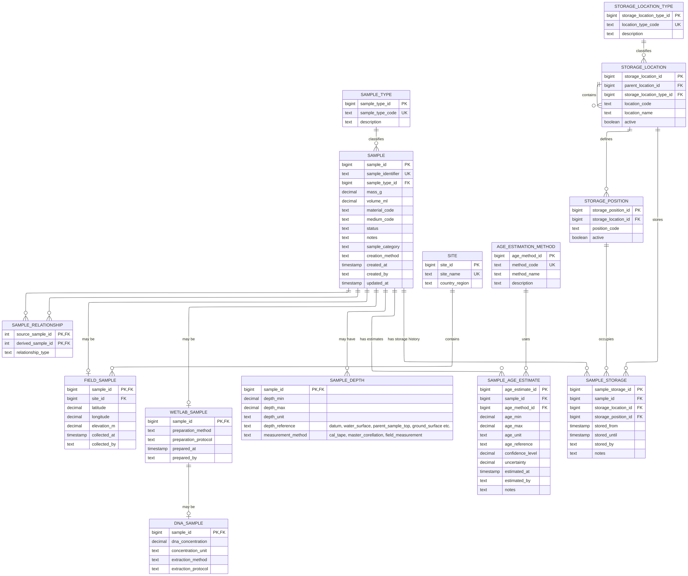

```mermaid
---
config:
  layout: elk
  er:
    layoutDirection: LR
    entityPadding: 8
    diagramPadding: 15
    useMaxWidth: false
---
erDiagram

    SAMPLE {
        bigint sample_id PK
        text sample_identifier UK
        bigint sample_type_id FK
        

        decimal mass_g
        decimal volume_ml
        text material_code
        text medium_code

        text status
        text notes
        text sample_category
        text creation_method
        timestamp created_at
        text created_by
        timestamp updated_at
    }

    SAMPLE_TYPE {
        bigint sample_type_id PK
        text sample_type_code UK
        text description
    }

    FIELD_SAMPLE {
        bigint sample_id PK, FK
        bigint site_id FK
        decimal latitude
        decimal longitude
        decimal elevation_m
        timestamp collected_at
        text collected_by
    }

    WETLAB_SAMPLE {
        bigint sample_id PK, FK
        text preparation_method
        text preparation_protocol
        timestamp prepared_at
        text prepared_by
    }

    DNA_SAMPLE {
        bigint sample_id PK, FK
        decimal dna_concentration
        text concentration_unit
        text extraction_method
        text extraction_protocol
    }

    SITE {
        bigint site_id PK
        text site_name UK
        text country_region
    }

    SAMPLE_DEPTH {
        bigint sample_id PK, FK
        decimal depth_min
        decimal depth_max
        text depth_unit
        text depth_reference "datum, water_surface, parent_sample_top, ground_surface etc."
        text measurement_method "cal_tape, master_corellation, field_measurement"
    }

    SAMPLE_AGE_ESTIMATE {
        bigint age_estimate_id PK
        bigint sample_id FK
        bigint age_method_id FK
        decimal age_min
        decimal age_max
        text age_unit
        text age_reference
        decimal confidence_level
        decimal uncertainty
        timestamp estimated_at
        text estimated_by
        text notes
    }

    AGE_ESTIMATION_METHOD {
        bigint age_method_id PK
        text method_code UK
        text method_name
        text description
    }

    SAMPLE_RELATIONSHIP {
        int source_sample_id PK,FK
        int derived_sample_id PK,FK
        text relationship_type
    }


    STORAGE_LOCATION {
        bigint storage_location_id PK
        bigint parent_location_id FK
        bigint storage_location_type_id FK
        text location_code
        text location_name
        boolean active
    }

    STORAGE_LOCATION_TYPE {
        bigint storage_location_type_id PK
        text location_type_code UK
        text description
    }

    STORAGE_POSITION {
        bigint storage_position_id PK
        bigint storage_location_id FK
        text position_code
        boolean active
    }

    SAMPLE_STORAGE {
        bigint sample_storage_id PK
        bigint sample_id FK
        bigint storage_location_id FK
        bigint storage_position_id FK
        timestamp stored_from
        timestamp stored_until
        text stored_by
        text notes
    }

    SAMPLE_TYPE ||--o{ SAMPLE : classifies

    SAMPLE ||--o| FIELD_SAMPLE : "may be"
    SAMPLE ||--o| WETLAB_SAMPLE : "may be"
    WETLAB_SAMPLE ||--o| DNA_SAMPLE : "may be"

    SITE ||--o{ FIELD_SAMPLE : contains

    SAMPLE ||--o{ SAMPLE_DEPTH : "may have"

    SAMPLE ||--o{ SAMPLE_AGE_ESTIMATE : "has estimates"
    AGE_ESTIMATION_METHOD ||--o{ SAMPLE_AGE_ESTIMATE : uses

    SAMPLE ||--o{ SAMPLE_RELATIONSHIP : ""
    SAMPLE ||--o{ SAMPLE_RELATIONSHIP : ""

    STORAGE_LOCATION_TYPE ||--o{ STORAGE_LOCATION : classifies
    STORAGE_LOCATION ||--o{ STORAGE_LOCATION : contains
    STORAGE_LOCATION ||--o{ STORAGE_POSITION : defines

    SAMPLE ||--o{ SAMPLE_STORAGE : "has storage history"
    STORAGE_LOCATION ||--o{ SAMPLE_STORAGE : stores
    STORAGE_POSITION ||--o{ SAMPLE_STORAGE : occupies
```