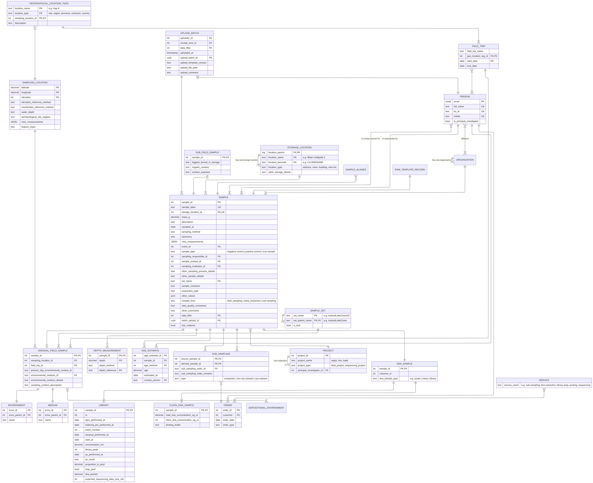

NOTE: 
1. A master sample is defined as a physical sample that has been split into many segments.
2. We might need a single column in the field sample template for geo location classification which will include all names or identifiers of the location from least local to most local? Example Africa: North Africa: Egypt: Giza: Giza Necropolis: The Great Pyramid of Giza: Area B: Trench 5: Locus 102: Layer 4 
3. Data responsible or template filler or both?
4. Use email as unique person id
5. Controlled vocabs are missing.
6. SAMPLE_SET could replace PROJECT and be a way to easily identify a set of samples by Kurt for example. Might not be needed  though.
7. The difference between an ORDER and a SAMPLE_SET is that a sample might be part of many orders but only part of 1 sample set. 

NEEDS CLARIFICATION:
1. Can all samples get age estimates?
2. Can a sub project be part of many master projects?
3. Rename SAMPLING_LOCATION to SAMPLE_ORIGIN?
4. Move water_depth? To a sampling context?
5. How to get information about the responsible instittion/organisation i.e. who the sampling responsible is taking the sample on behalf of?
6. How to define a field trip? How to make sure the field trip attributes are provided?
7. Should it be allowed for a sampling location to have more than 1 environment?
8. Where should principal investigator be an attribute?
9. What is archive sample number?
10. How to log updates, inserts and deletions? 
11. How to get archive sample storage info?
12. Does archive_sample_material_left indicate parent material left or archive material left?
13. what is archive sample serial_id?
14. Could the number of person columns be reduced?
15. What is wet_lab_no in wetlab report?
16. What is the cardinality between DNA_LYSATE and DNA_CLEAN and how to track provenance?
17. Do library dates relate to other dna samples?
18. What is Pool and what is library data?