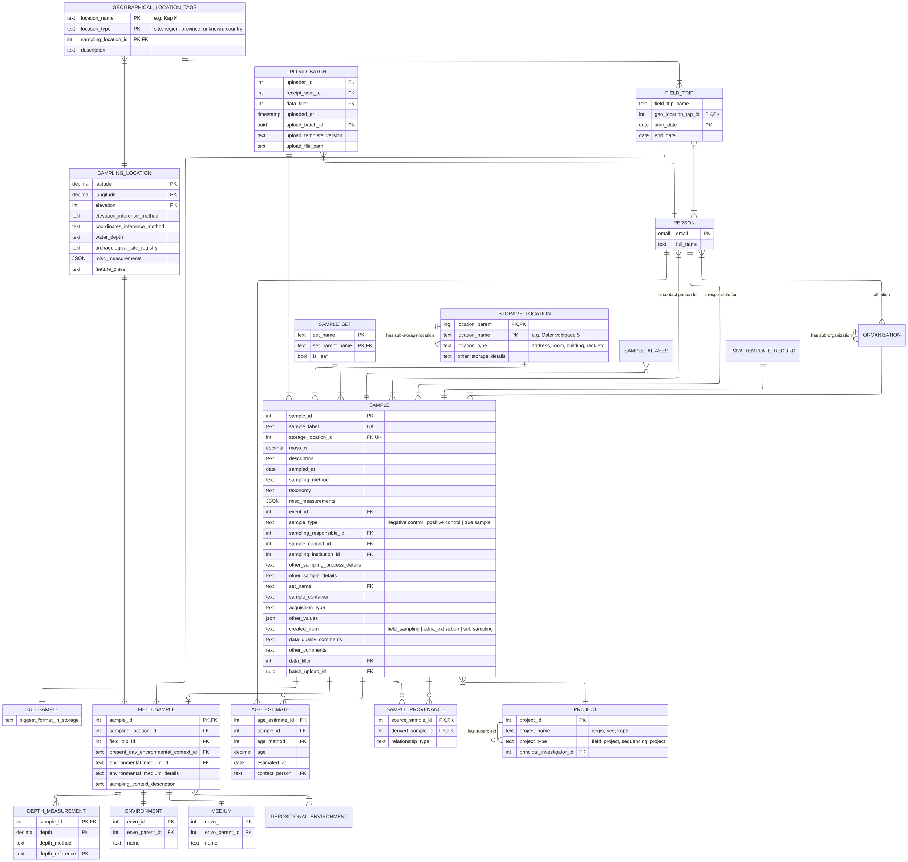

NOTE: 
1. A master sample is defined as a physical sample that has been split into many segments.
2. We might need a single column in the field sample template for geo location classification which will include all names or identifiers of the location from least local to most local? Example Africa: North Africa: Egypt: Giza: Giza Necropolis: The Great Pyramid of Giza: Area B: Trench 5: Locus 102: Layer 4 
3. Data responsible or template filler or both?
4. Use email as unique person id

NEEDS CLARIFICATION:
1. Can all samples get age estimates?
2. Can a sub project be part of many master projects?
3. Rename SAMPLING_LOCATION to SAMPLE_ORIGIN?
4. Move water_depth? To a sampling context?
5. How to get information about the responsible instittion/organisation i.e. who the sampling responsible is taking the sample on behalf of?
6. How to define a field trip? How to make sure the field trip attributes are provided?
7. Should it be allowed for a sampling location to have more than 1 environment?
8. Where should principal investigator be an attribute?