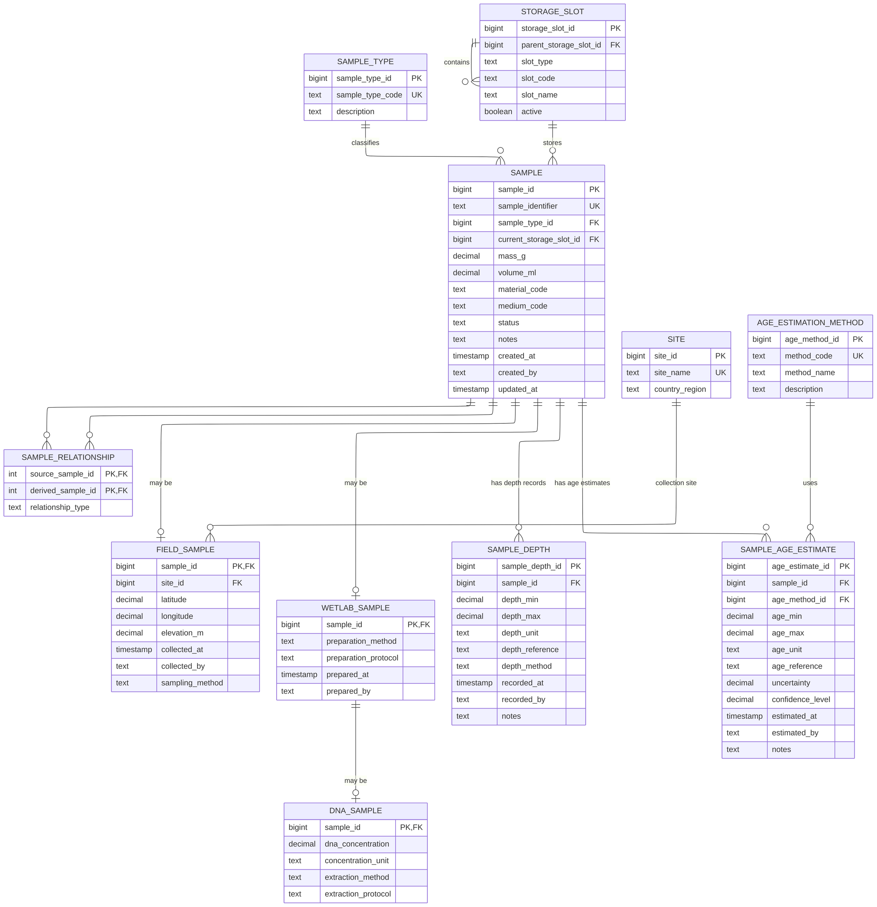

```mermaid
---
config:
  layout: elk
  er:
    layoutDirection: LR
    entityPadding: 8
    diagramPadding: 15
    useMaxWidth: false
---
erDiagram

    SAMPLE {
        bigint sample_id PK
        text sample_identifier UK
        bigint sample_type_id FK
        bigint current_storage_slot_id FK

        decimal mass_g
        decimal volume_ml
        text material_code
        text medium_code

        text status
        text notes
        timestamp created_at
        text created_by
        timestamp updated_at
    }

    SAMPLE_TYPE {
        bigint sample_type_id PK
        text sample_type_code UK
        text description
    }

    FIELD_SAMPLE {
        bigint sample_id PK, FK
        bigint site_id FK

        decimal latitude
        decimal longitude
        decimal elevation_m

        timestamp collected_at
        text collected_by
        text sampling_method
    }

    WETLAB_SAMPLE {
        bigint sample_id PK, FK

        text preparation_method
        text preparation_protocol
        timestamp prepared_at
        text prepared_by
    }

    DNA_SAMPLE {
        bigint sample_id PK, FK

        decimal dna_concentration
        text concentration_unit
        text extraction_method
        text extraction_protocol
    }

    SITE {
        bigint site_id PK
        text site_name UK
        text country_region
    }

    SAMPLE_DEPTH {
        bigint sample_depth_id PK
        bigint sample_id FK

        decimal depth_min
        decimal depth_max
        text depth_unit
        text depth_reference
        text depth_method

        timestamp recorded_at
        text recorded_by
        text notes
    }

    SAMPLE_AGE_ESTIMATE {
        bigint age_estimate_id PK
        bigint sample_id FK
        bigint age_method_id FK

        decimal age_min
        decimal age_max
        text age_unit
        text age_reference

        decimal uncertainty
        decimal confidence_level

        timestamp estimated_at
        text estimated_by
        text notes
    }

    AGE_ESTIMATION_METHOD {
        bigint age_method_id PK
        text method_code UK
        text method_name
        text description
    }

    
    SAMPLE_RELATIONSHIP {
        int source_sample_id PK,FK
        int derived_sample_id PK,FK
        text relationship_type
    }
 

    STORAGE_SLOT {
        bigint storage_slot_id PK
        bigint parent_storage_slot_id FK

        text slot_type
        text slot_code
        text slot_name
        boolean active
    }

    SAMPLE_TYPE ||--o{ SAMPLE : classifies

    SAMPLE ||--o| FIELD_SAMPLE : "may be"
    SAMPLE ||--o| WETLAB_SAMPLE : "may be"
    WETLAB_SAMPLE ||--o| DNA_SAMPLE : "may be"

    SITE ||--o{ FIELD_SAMPLE : "collection site"

    SAMPLE ||--o{ SAMPLE_DEPTH : "has depth records"

    SAMPLE ||--o{ SAMPLE_AGE_ESTIMATE : "has age estimates"
    AGE_ESTIMATION_METHOD ||--o{ SAMPLE_AGE_ESTIMATE : uses

    SAMPLE ||--o{ SAMPLE_RELATIONSHIP : ""
    SAMPLE ||--o{ SAMPLE_RELATIONSHIP : ""

    STORAGE_SLOT ||--o{ STORAGE_SLOT : contains
    STORAGE_SLOT ||--o{ SAMPLE : stores
```